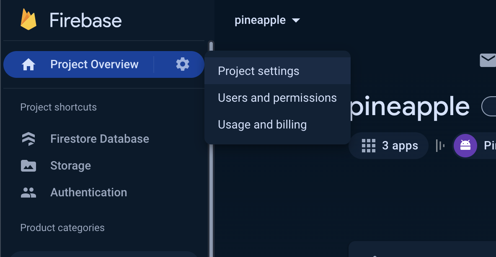
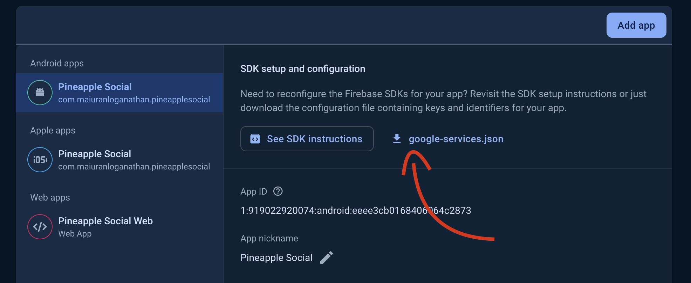

# Pineapple

Pineapple is a mobile application built with Expo. This README outlines the steps required to install, configure, and run the application on your local machine.

## Installation

Clone the repository and install dependencies:

```bash
git clone https://github.com/pineapple-social/mobile-app
cd mobile-app
npm install
npm start
```
 
## Pre-requisites

Before you begin, ensure you have followed the instructions on [Expo Local App Development](https://docs.expo.dev/guides/local-app-development/#local-builds-with-expo-dev-client) to set up Expo's local app development tool.

### System Requirements

- Android Studio (for Android development)
- Xcode (for iOS development)
- Ruby and Cocoapods (for iOS dependencies)

### Prebuild Setup

Run the prebuild command to generate platform-specific folders:

```bash
npx expo prebuild
```

This command generates `ios` and `android` folders in the build directory, containing native code for each platform. These folders are ignored by Git.

Configure your SDK path:

- For macOS: `sdk.dir = /Users/<username>/Library/Android/sdk`
- For Windows: `sdk.dir = C:\\Users\\<username>\\AppData\\Local\\Android\\sdk`

## Running the App

To run your app without Expo Go, use one of the following commands:

```bash
npx expo start --dev-client
npm run start:dev
npx expo run:[android/ios]
```

## Google Sign-In Setup

Download `google-services.json` and `GoogleService-Info.plist` from Firebase, and place them in the root directory of the project. Instructions for downloading these files can be found in the images below:

<table>
  <tr>
    <td>
      
    </td>
    <td>
      
    </td>
  </tr>
</table>

### Creating Secrets for Google Services

Run the following commands to create secrets for your Google services:

```bash
eas secret:create --scope project --name GOOGLE_SERVICES_JSON --type file --value /path/to/google-services.json
eas secret:create --scope project --name GOOGLE_SERVICES_INFOPLIST --type file --value /path/to/GoogleService-Info.plist
```

### Obtaining the SHA-1 Key

Generate the SHA-1 key for your project:

```bash
cd android && ./gradlew signingReport
```

## Deploying Firebase Functions

To deploy a Firebase function:

```bash
cd functions/
npm run deploy
```

## Testing Notes

### Apple Authentication

Apple Auth does not work on simulators. Testing must be done on a real device.
